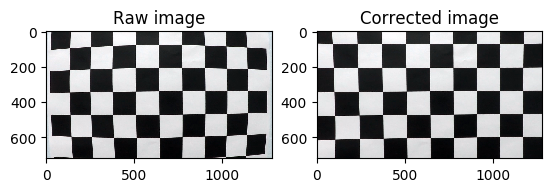
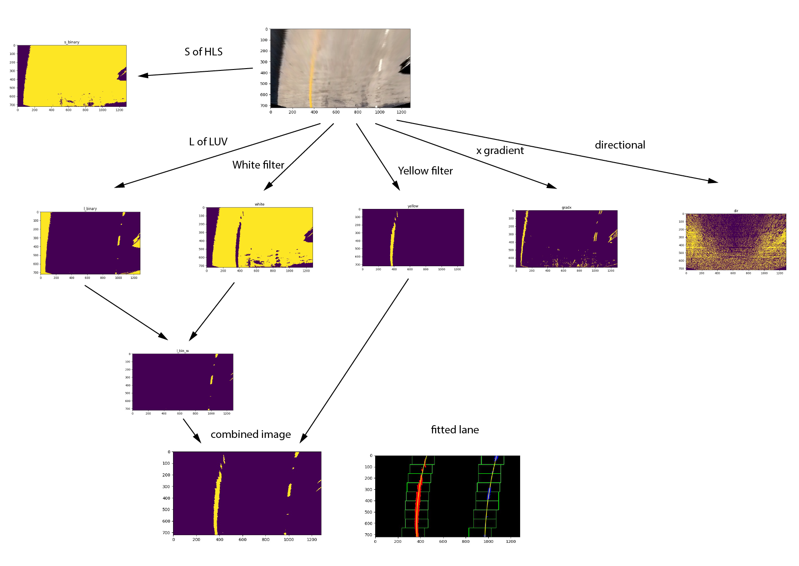
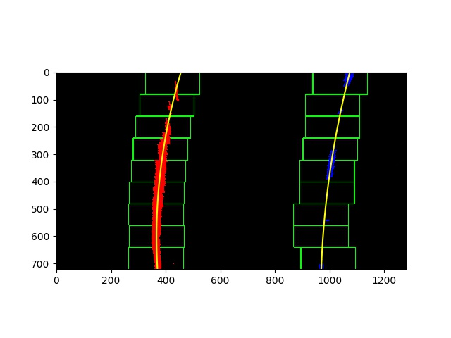

# Advanced Lane Finding Project
[](http://www.udacity.com/drive)


## About this project
This project implements computer vision techniques to identify the lane lines in the images or videos taken by a camera mounted on a car.

## Camera Calibration

I use a series of chessboard images to find the calibration parameters of the camera images. I first prepare an array of "object points" that the corners of the chessboard images should be mapped to. Then, I use ```cv2.findChessBoardCorners()``` to find the coordinates of the chessboard corners. These coordinates are "image points". I then used these image points and object points as the input of ```cv2.calibrteCamera()``` to find the camera matrix and distortion coefficients required to correct the distorted images. After that, the camera matrix and distortion coefficients are used as the input of ```cv2.undistort()``` to perform the image correction. An example of the image correction is shown as below:



The process of camera calibration and distorted image corrections are wrapped in the class ```image_process.CameraCalibrator```.

## Perspective transformation

I use ```cv2.getPerspectiveTransform()``` and ```cv2.warpPerspective()``` to perform the perspective transformation of road images. Since we are dealing with one camera and car system in this project, the parameters for performing perspective transormation is the same. I simply hardcoded the source and destination coordinates by handpicking these coordinates on a straight road images.
These coordinates are:

| Source        | Destination   | 
|:-------------:|:-------------:| 
| 250, 686      | 340, 720        | 
| 583, 458      | 340, 0      |
| 700, 458     | 940, 0      |
| 1060, 686      | 940, 720        |

The resuling images are shown below:


This process is wrapped in the class ```image_process.PerspectiveTransformer```.


## Lane identification

I made the following binary image masks in order to identify the lanes in an image. The code of this procedure is in ```yellow_white_HLS()```.

#### Yellow filters
This filter selects the parts in the image with yellow color. The yellow color is defined as the color values between ```[70, 80, 100]``` and ```[105, 255, 255]``` in HSV space.

#### White filters
This filter selects the parts in the image with white color. The white color is deined as the color values between ```[10, 0, 160]``` and ```[255, 80, 255]```.

#### S channel
This filter selects the parts in the image that has color values between ```[0, 0, 130]``` and ```[0, 0, 255]``` in HLS color space.

#### X gradient
The filter selects the parts in the image that has high grdient in the x direction in gray scale. In practice, this implemented by applying Sobel matrix to the image using ```cv2.Sobel```. The threshold is selected to be between 0.7 and 1.3.

#### Directional gradient
The filter selects the parts in the image has image gradient in certain direction, which is defined by 0.7<arctan(grady/gradx)<1.3

The examples of these images are shown in the following graph:



Through trying a lot of combinations, I found the following operation
```
((s_channel == 1) & (white == 1)) | (yellow == 1) | (
        (grad_x == 1) & (directional == 1) & (white == 1)) = 1
```
can give reasonable results across all images in the project video.

This process in written in the function ```image_process.yellow_white_hls()```.


## Fit the Lanes

I use sliding windows to find the lanes coordinates in the image. This method indentifies the lanes using the following procedures:

1. The image is sliced in 9 portions in the y direction.
2. In the top slice, set two windows that are centered at the peaks of histograms.
3. All the color pixels within the windows are set to be the coordiates of the lane for fitting.
4. If there are enough points in the window, recenter the window for the next slice.
5. Iterate step 3 throughout all the windows.
6. Fit all points found in all the windows with quadratic polynomials.

An exmple image of this process is shown below:


The codes of these procedures can be found in ```image_process.LandFinder.fit_by_window()```.

## Find the radius of curvature of the lane


### Radius of curvature
The radius of curvature in a cartesian coordinate system is defined as


Since our lanes are fitted with a quadratic polynomial:


The radius of curvature at __(x0,y0)__ can then be written as:


I choose the bottom point of the image to caluclate the curvature of radius because it is what the car should immediately repspond to.

### Calibrate the scale of the image

To correct the scale of the camera images, we use the following estimation:

- The width of the lane is 3.7 m.
- The length of the lane is 30 m.

Therefore, each pixel in horizontal direction corresponds to ay=3.7/600=0.0061 m and each pixel in vertical direction corresponds to ax=30/720=0.042 m. The new quadratic polynomial becomes:


where ```y'=ay*y``` and ```x'=ax*x```.

The procedures of calculating the fitting parameters is in ```image_process.LandFinder._curve_rad_m()```

### Result

Below is a final image with the radius of curvatures of left and right lanes marked on the top of the image:


The resulting video is [project_video_output.mp4](./project_video_output.mp4)


## Discussion

Overcoming the shadows and different color of pavements is very challenging in this project. It is quite difficult to find a set of parameter that works for all road conditions. Different colors of lane lines or pavement are likely to fail the lane line identification algorithm.

Another difficulty is getting accurate radius of curvature from the white dashed land lines. The spaces between each segment of white lines causes more error in the fitting. 

To obtain better results of a frame in a video, one has to use the information of previous frames in the video to help reduce the errors of a single frame.


